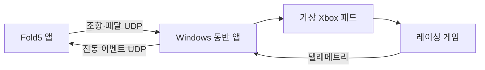

# PhoneWheel — Galaxy Z Fold5 레이싱 컨트롤러 구현 지침

작성·문헌 확인: 2026-09-07. 대상: 개인 사용을 위한 Windows PC + Galaxy Z Fold5.

**구현을 시작할 만한 구성입니다. 먼저 가상 Xbox 패드의 게임 인식과 조향 응답을 확인하고, Fold5의 회전·터치 입력을 연결한 뒤, 검증된 텔레메트리 이벤트에만 진동을 추가합니다.** 새로운 휴대전화 구매는 현재 필요조건이 아닙니다. 이 패키지는 설계서, 구현 지시, 실행 가능한 Python 참조 모델과 검증 도구입니다. APK·Windows 완성 앱·새 드라이버는 포함하지 않습니다.

## 1. 확정한 요구사항

| 항목 | 이번 프로젝트의 결정 |
|---|---|
| 휴대전화 | 보유한 Galaxy Z Fold5로 시작. 기본 실험은 접은 상태의 커버 화면을 가로로 사용 |
| 조작 | 화면 정면을 향한 축 주위의 회전으로 조향, 왼손 엄지 브레이크, 오른손 엄지 가속 |
| 아날로그 | 조향 -1…1, 브레이크 0…1, 가속 0…1. 두 페달을 동시에 입력할 수 있어야 함 |
| 페달 감지 | 독립 터치 영역의 드래그 거리. 터치 압력을 실제 페달 하중처럼 사용하지 않음 |
| 보조 기능 | 게임의 자동 변속·자동 클러치를 사용. 앱은 페달을 자동 조작하지 않음 |
| 진동 | 잠김·헛돎처럼 운전자가 대응할 수 있는 상태가 우선. 엔진 지속 진동·자동 변속 충격은 기본 OFF |
| 게임 | 원작 Assetto Corsa, F1 25의 2026 Season Pack/Season Edition PC 버전 |
| 플랫폼 | Windows 11 x64를 기본 대상으로 가정. 다른 Windows/ARM64는 별도 검증 |
| 연결 | 같은 로컬 네트워크의 UDP. USB 테더링 네트워크와 Wi-Fi를 같은 프로토콜로 비교 |
| 비용 | 공개 무료 드라이버·SDK 기반 시제품. 게임과 기존 장비 비용은 별도 |
| 범위 밖 | 물리적 복원 토크, 900도 휠과 같은 잡아 돌리기, 콘솔 직접 연결, 온라인 서버, ML 기반 실시간 보정 |

화면을 펼친 모드는 후속 사용성 실험으로 허용합니다. 접힘 상태, 화면 크기 또는 방향이 달라지면 먼저 입력을 해제하고 재보정합니다. 화면 방향 고정 요청이 OS·대화면 정책상 항상 지켜진다고 가정하지 않습니다.

## 2. 조사로 확인한 사실과 구현상 의미

1. **ViGEmBus와 SDK는 무료 공개 소프트웨어이나 유지보수가 종료되었습니다.** 공식 설치 프로그램 1.22.0을 시제품 후보로 사용하되, 해당 PC의 서명·로드·게임 인식을 Gate 1에서 확인합니다. 이 버전은 설치 프로그램 버전이며 실제 드라이버 버전과 같다고 단정하지 않습니다. 배포본에 드라이버 바이너리를 임의로 묶지 않습니다. [S1–S3]
2. **가상 Xbox 패드는 실제 레이싱 휠과 입력 경로가 다릅니다.** LX에 매핑한 값에 게임의 패드용 감도·데드존·조향 속도 보정이 더해질 수 있습니다. 조향 각도가 바퀴 각도와 1:1이 된다는 주장은 하지 않습니다. 이것이 맞지 않으면 출력 인터페이스를 유지하고 DirectInput 계열 백엔드를 별도로 평가합니다.
3. **LT/RT는 각각 8비트 0…255, LX는 -32768…32767입니다.** 독립 페달 동시 입력은 XInput에서 확인해야 합니다. `joy.cpl`의 레거시 표시만 보고 두 트리거가 고장 났다고 판단하지 않습니다. [S4–S5]
4. **F1의 2026 시즌은 F1 25 확장 콘텐츠입니다.** EA는 게임 설정에서 UDP 형식을 선택할 수 있다고 안내합니다. 첫 구현은 본문을 대조한 2025 UDP 형식으로 진행하고, 2026 전용 형식은 별도 파서로 추가합니다. 상품 이름과 UDP 형식 번호를 분리합니다. [S6–S8]
5. **EA의 Xbox 패드 지원 목록은 가상 드라이버 지원 보증이 아닙니다.** 공식 안내에 Javelin 관련 연결 문제도 언급되어 있어 실제 게임 검증이 필요합니다. 차단되면 오류와 버전을 기록하고 지원되는 경로를 재검토합니다. 보안 설정·안티치트를 끄거나 우회하는 방식은 이 프로젝트의 해결책으로 사용하지 않습니다. [S9]
6. **Fold5의 성능 등급·120Hz 화면만으로 센서 지연이나 정확도를 확정할 수 없습니다.** Android의 센서 주기 요청은 힌트이며, 실제 주기는 타임스탬프로 측정합니다. 자력계를 쓰지 않는 게임 회전 벡터도 장시간 드리프트가 가능하므로 보정·실측이 필요합니다. [S10–S11]
7. **진동 세기·효과 지원도 런타임 검사 대상입니다.** 하나의 논리적 진동 채널을 기준으로 설계하고 `VibratorManager`로 실제 능력을 기록합니다. 여러 액추에이터를 개별 제어할 수 있다고 전제하지 않습니다. [S12]
8. **일반 HID 또는 Microsoft VHF가 Xbox/XInput으로 자동 인식되는 것은 아닙니다.** VHF는 별도 HID 드라이버 개발을 위한 프레임워크로, 무료 완제품 드라이버를 대체해 바로 넣는 단계가 아닙니다. [S13]

출처 ID의 실제 URL과 확인 범위는 `docs/SOURCES.md`에 있습니다. 위 2번의 게임별 조향 품질 판단은 구현 가설이며 실기 검증 대상입니다.

## 3. 구현 구조



게임 텔레메트리는 **게임에서 나오는 관측 데이터**입니다. 조작 명령은 가상 패드를 통해 들어갑니다. 게임 텔레메트리 포트를 휴대전화 조작 수신 포트로 사용하지 않습니다.

| 모듈 | 책임 | 입력·출력 |
|---|---|---|
| Android `SensorSource` | 센서 탐색, 시간·품질 기록 | 회전 벡터 → 정규화 쿼터니언 |
| Android `SteeringEstimator` | 보정 기준, 상대 회전, 최소 필터 | 쿼터니언 → 각도·조향값·유효성 |
| Android `PedalTouchView` | 두 pointer ID의 소유·해제 | 멀티터치 → 독립 페달값 |
| 공통 `ControlCodec` | 바이트 순서·길이·HMAC | 논리 입력 ↔ PWR1 데이터그램 |
| Windows `SafetyGate` | 세션·순서·신선도·활성화 검사 | 입력 → 최신 상태 또는 중립 |
| Windows `IGamepadOutput` | 드라이버 격리 | `Write(Controls)`, `Neutralize()`, `Dispose()` |
| Windows `ITelemetrySource` | 게임별 읽기·버전·상태 확인 | 원본 → 유효성 표시된 공통 관측값 |
| Windows `EventDetector` | 조건·단위가 검증된 상태 판정 | 관측값 → 잠김/헛돎/선택 이벤트 |
| Android `HapticScheduler` | 우선순위·패턴·만료 | 이벤트 → 제한된 진동 |
| 공통 `Diagnostics` | 지연·손실·보정·이벤트 근거 | 회전 가능한 CSV/JSON 로그 |

가상 패드에 쓰는 스레드는 하나로 직렬화합니다. ViGEmClient는 thread-safe하지 않다고 명시되어 있습니다. UI, 수신, 텔레메트리 콜백에서 직접 드라이버를 동시에 호출하지 않습니다. [S3]

## 4. 기술 스택과 빌드 전략

| 계층 | 시작 구성 | 고정·확인 사항 |
|---|---|---|
| Android | Kotlin, 네이티브 Activity + Custom View, minSdk 33 | Fold5의 실제 Android/API/One UI 버전 기록 |
| Android 빌드 | compileSdk/targetSdk 37, AGP 9.3.2, Gradle 9.5.0, JDK 17 후보 | 공식 호환표와 설치 SDK 확인 후 wrapper·버전 고정. 이 조합으로 여기서 APK 빌드를 실행하지는 않음 |
| Kotlin 플러그인 | AGP 내장 Kotlin 경로 | 외부 `org.jetbrains.kotlin.android`를 관성적으로 중복 추가하지 않음. 실제 해결된 버전을 기록 |
| Windows | C# .NET 10 LTS, `net10.0-windows`, `win-x64` | 먼저 콘솔 Probe/Host, 이후 WPF UI. 설치된 SDK 정확한 버전을 `global.json`에 고정 |
| 가상 패드 클라이언트 | `Nefarius.ViGEm.Client` 1.21.256 | NuGet의 netstandard2.0 라이브러리. .NET 10 표기상 호환은 실제 native DLL 로드 확인을 대체하지 않음 |
| 휴대전화 연결 | UDP unicast, PWR1 | 제3자 서버·웹 브라우저·WebSocket은 초기 경로에 없음 |
| 참조 검증 | Python 3.10 이상, 표준 라이브러리 | 이번 실행 환경은 Python 3.12.13 |

AGP 호환표와 .NET 지원 정책을 확인한 기준안입니다. 설치된 정상 빌드 프로젝트가 있다면 기존 구성을 먼저 존중하고 필요한 최소 변경만 합니다. 외부 패키지 버전에 `+` 또는 무조건 `latest`를 사용하지 않습니다. [S2, S14–S16]

Android 권한은 `INTERNET`, `VIBRATE`가 기본입니다. targetSdk 37에서 Android 17 이상을 실행할 때는 `ACCESS_LOCAL_NETWORK` 런타임 권한 흐름을 구현합니다. 거부·회수 시 연결 대기 상태로 전환하고 입력을 해제합니다. 카메라 권한은 자체 QR 카메라 스캔을 구현한 경우에만 추가합니다. 200Hz를 넘는 원시 센서 실험은 별도 옵션으로 두고 필요한 권한·실제 제공률을 확인합니다. [S10, S17]

USB 케이블 연결은 곧바로 게임패드 연결이라는 뜻이 아닙니다. **USB 테더링으로 생긴 PC↔폰 IP 네트워크에 같은 UDP를 보내는 구성**입니다. Windows에서 그 어댑터의 실제 주소를 표시하고 왕복 통신을 확인합니다. 테더링 네트워크의 인터넷 연결 유무와 로컬 경로 성립 여부도 별개로 확인합니다. USB가 Wi-Fi보다 반드시 빠르다는 전제는 두지 않습니다.

## 5. 조향 알고리즘

1. `TYPE_GAME_ROTATION_VECTOR`를 우선 탐색합니다. 없으면 일반 `TYPE_ROTATION_VECTOR`를 비교 후보로 두되 자력계 영향 여부를 기록합니다. 없는데 값을 흉내 내어 입력을 활성화하지 않습니다.
2. 센서 등록은 5,000µs 주기 요청, `maxReportLatencyUs=0`으로 시작합니다. 실제 샘플 간격·콜백 도착 간격을 별도로 측정합니다. UI 그리기 주기와 센서 처리를 분리합니다.
3. Android 벡터를 `SensorManager.getQuaternionFromVector` 등 공식 API로 `(w,x,y,z)` 쿼터니언으로 변환합니다. 반환 순서와 device→world 회전 관례를 실물의 좌·우 회전으로 확인합니다. 센서 좌표축은 화면 회전에 따라 자동 변경되지 않습니다. [S10–S11]
4. 사용자가 정면 중립으로 잡고 **중앙 보정**을 누르면 `q0`를 저장합니다. 잘못된 센서 상태·터치 중에는 먼저 페달을 해제합니다. 보정 직후 자동 활성화하지 않습니다.
5. 단위 쿼터니언에서 `qRel = inverse(q0) * q`를 계산합니다. 보정 당시 화면 바깥 방향인 +Z축에 대한 twist를 추출합니다. 참조식은 `theta = wrap180(2 * atan2(qRel.z, qRel.w))`입니다. `q`와 `-q`가 동일 회전이라는 점을 처리합니다.
6. 반대 축으로 180도 뒤집혀 twist가 정의되지 않는 경우나 비정상 값은 invalid입니다. MVP의 사용 범위는 보정 자세에서 조향 ±135도 이내, 화면 기울어짐은 대략 45도 이내로 제한해 실험합니다. 후자는 앱에서 별도 swing/자세 검사로 구현할 항목이며 Python 참조 모델에 포함되지 않습니다.
7. 손으로 화면을 시계방향으로 돌릴 때 오른쪽 조향이 되도록 부호를 확인합니다. 기본 `sign=-1`, `halfRange=90°`, `deadzone=0.5°`입니다. 전체 180도 범위와 한쪽 90도를 혼동하지 않습니다.
8. 정규화는 `u = sign * sign(theta) * clamp((abs(theta)-deadzone)/(halfRange-deadzone), 0, 1)`입니다. 게임별 halfRange를 변경할 수 있습니다. 우선 감마 1.0, 추가 예측 0으로 시작합니다.
9. 필터는 필요할 때만 1차 저역통과, 초기 시정수 8ms로 둡니다. `alpha=1-exp(-dt/tau)`. 센서 timestamp 차이를 사용하고 100ms 초과 공백은 재활성화가 필요한 상태로 처리합니다. 진동 중 필터를 무조건 강하게 만드는 동작은 넣지 않습니다.

쿼터니언 수학 테스트는 Android OS의 융합 센서가 정확하다는 증명이 아닙니다. 수평으로 눕혀 잡으면 조향 축이 중력 축에 가까워져 방위각 드리프트가 더 문제가 될 수 있습니다. 편한 수직에 가까운 자세부터 비교하고, 장시간 자동 중앙 이동은 금지합니다. 코너를 돌고 있는 상태가 중앙으로 학습될 수 있기 때문입니다.

## 6. 아날로그 페달과 휴대전화 UI

화면 중앙에는 작은 조향 표시와 연결 상태만 둡니다. 엄지 영역을 계기판으로 채우지 않습니다. 왼쪽에는 브레이크, 오른쪽에는 가속의 넓은 세로 영역과 시작 기준선을 표시합니다.

- 기본 모드는 상대 드래그입니다. 터치 시작 값은 0, 시작점에서 위로 이동한 거리 / 전체 스트로크가 값입니다. 처음 누르는 위치가 곧바로 100%가 되는 동작을 피합니다.
- 전체 스트로크는 초기 72dp, 사용자 조절 48…120dp입니다. 참조 코드 인자는 px이므로 Android에서는 density로 변환합니다. 전체 스트로크가 들어갈 수 있는 하단 시작 영역을 확보합니다.
- pointer **index가 아닌 ID**로 소유권을 고정합니다. 손가락이 다른 영역으로 넘어가도 소유권을 바꾸지 않습니다. 한쪽 손가락을 떼어 다른 pointer index가 바뀌어도 값이 섞이지 않아야 합니다.
- `ACTION_UP`, 해당 `ACTION_POINTER_UP`, `ACTION_CANCEL`, Activity 비활성화, 창·접힘 변경 시 대상 페달을 즉시 0으로 만듭니다. 해제값에는 느린 필터나 가속 잔류를 적용하지 않습니다.
- 두 페달은 동시에 값이 남을 수 있습니다. 임의로 브레이크가 가속을 0으로 덮어쓰지 않습니다. 자동차·게임이 자체적으로 동시 입력을 처리하는 것은 별도로 관찰합니다.
- 화면 가장자리 시스템 제스처와 겹치지 않게 inset을 확보합니다. 시스템이 터치를 취소할 때 반드시 해제합니다.
- 중앙 보정, 연결/활성화, 즉시 해제 버튼을 구분합니다. 정지 상태에서만 쓰는 설정은 주행 화면에서 작은 메뉴로 숨깁니다. 버튼 이름은 “중앙 보정”, “운전 시작”, “입력 해제”처럼 명확하게 합니다.

정밀한 트레일 브레이킹의 가장 큰 미확정 요소는 터치 조작감입니다. 페달을 30% 유지한 채 빠르게 조향하는 실험을 반드시 포함합니다. 회전 센서만 좋다고 이 사용성이 보장되지는 않습니다.

## 7. 통신·활성화·고장 처리

정확한 바이트 정의는 `docs/PROTOCOL.md`를 구현 계약으로 사용합니다. Python 참조 코드가 구현하는 범위는 Control 패킷과 PC 입력 상태 머신입니다. Hello/Status/Haptic 인코더, 실제 소켓, 재연결 UI는 후속 구현 대상입니다.

| 값 | 초기 설정 | 목적 |
|---|---:|---|
| 폰 입력 송신 | 120Hz | 현재 센서·터치의 일관된 최신 스냅샷 |
| PC Status 송신 | 20Hz | 상태 안내와 receiver-clock freshness challenge |
| PC 출력·watchdog 작업 | 250Hz 목표 | UI 정지와 무관한 입력 해제; OS 실시간 보장은 아님 |
| 입력 단절 제한 | 150ms | 유효 입력이 끊기면 전 축·버튼 중립 |
| challenge/ACK 신선도 | 100ms | 새 순번이지만 네트워크에서 오래 지연된 패킷도 거부 |
| 재활성화 | 300ms 연속 중립 + 시작 버튼 | 연결 복구 시 이전 가속이 자동 재개되는 문제 방지 |
| 텔레메트리 신선도 | 빠른 관측값 100ms | 오래된 차 상태로 진동하지 않기 |
| 진동 상태 통지 | 최대 30Hz | 패턴 재생과 상태 갱신을 분리 |
| 진동 임대시간 | 기본 100ms, 최대 150ms | 통신 단절 시 폰 자체에서 진동 종료 |

송신 큐에 과거 입력을 쌓지 않습니다. 타이머가 밀리면 밀린 프레임 수만큼 연달아 보내지 않고 최신값 한 개를 보냅니다. 수신 배치도 모두 순서·인증 검사 후 가장 최신 유효 상태만 출력합니다. 미인증·잘린·NaN·잘못된 세션 패킷으로 정상 watchdog 시간을 연장하지 않습니다.

입력 해제 시 조향 0, 가속 0, 브레이크 0, 버튼 0입니다. 브레이크를 자동 100%로 만드는 정책은 기본값이 아닙니다. 이 정책은 입력을 놓는 것이며 게임의 차량을 안전하게 멈추는 보장은 아닙니다. PC 앱 자체가 중단·종료될 때의 가상 장치 해제도 실제로 확인합니다.

페어링은 PC가 생성한 32바이트 무작위 키와 세션 ID를 사용합니다. 초기 개발 UI에서는 PC에 표시한 페어링 값을 수동 전달할 수 있고, 사용성 개선 단계에서 QR을 추가합니다. 공개 테스트 키를 실사용에 사용하지 않습니다. HMAC은 위변조·발신자 확인에 쓰이며 암호화는 아닙니다. 개인망에서 필요한 포트·어댑터만 수신하고, 키는 로그·스크린샷에서 제외합니다.

## 8. Windows 가상 패드

첫 콘솔 프로그램은 폰 없이 가상 Xbox 패드 하나를 만들고, 사용자가 시작한 테스트 순서에 따라 중립 → LX ±50% → LT 50% → RT 50% → LT/RT 동시 100% → 중립을 출력하게 합니다. 운전 중 자동으로 이 진단 시퀀스를 실행하지 않습니다.

설치 후보는 공식 [ViGEmBus 릴리스](https://github.com/nefarius/ViGEmBus/releases/tag/v1.22.0)입니다. 서명된 공식 설치 프로그램의 게시자·상태를 확인한 뒤 필요한 Windows 관리자 설치 절차를 따릅니다. 앱 실행마다 설치하거나 관리자 권한을 요구하도록 만들지 않습니다. SDK 복원 예:

```powershell
dotnet new console --name PhoneWheel.Probe --framework net10.0
dotnet add PhoneWheel.Probe/PhoneWheel.Probe.csproj package Nefarius.ViGEm.Client --version 1.21.256
```

프로젝트를 Windows/x64 대상으로 구성하고 실제 복원된 네이티브 라이브러리를 점검합니다. 각 필드를 바꿀 때마다 전송하지 않고 한 스냅샷을 완성한 후 한 번 제출하도록 SDK API를 확인합니다. 예외·종료·취소 경로에서는 중립 제출 후 장치를 Disconnect/Dispose 합니다.

LX=조향, LT=브레이크, RT=가속, 나머지 아날로그 축=0. XInput 구조체의 전체 범위를 사용하며 불필요한 라이브러리 기본 데드존을 중복 적용하지 않습니다. `IGamepadOutput`의 null/CSV 백엔드를 먼저 만들어 드라이버가 없는 개발 환경에서도 로직을 검증할 수 있게 합니다.

실제 출력 관찰:

```powershell
python tools/xinput_probe.py --seconds 30 > xinput.csv
```

이 도구는 XInput 슬롯 0…3을 읽기만 합니다. 가상 패드를 만들지 않으며, 연결된 슬롯이 가상 패드인지 단독으로 식별하지도 않습니다. Probe의 연결 전후와 알려진 입력 시퀀스를 비교해 해당 슬롯을 확인합니다. 실제 장치가 모두 슬롯을 점유하고 있는지도 확인합니다. Steam Input 등 중복 매핑은 게임별 실험 조건에 기록하고, 필요한 경우 해당 게임의 설정만 조절해 비교합니다.

## 9. F1 2026 시즌 연동

먼저 게임에서 UDP 출력 ON, 대상 `127.0.0.1`, 포트 `20777`, Broadcast OFF, UDP 형식 **2025**, 사용 가능한 60Hz를 선택해 측정합니다. 메뉴 표기는 설치 언어·버전에 따라 확인합니다. PC 동반 앱이 텔레메트리를 읽고 폰에는 선택된 진동 이벤트만 보냅니다. 다른 텔레메트리 앱과 포트가 충돌하면 별도 로컬 재전송기를 후속 추가합니다. 무조건 같은 포트에 중복 bind하지 않습니다.

EA F1 25 v3 PDF에서 이번에 대조한 최소 레이아웃: little endian, padding 없음, 공통 헤더 29바이트, Motion Ex ID 13/version 1/273바이트. 해당 패킷의 wheel speed는 byte 77, slip ratio는 byte 93부터 각각 float32 4개이며 순서는 RL/RR/FL/FR입니다. 참조 파서는 이 일부 값만 읽습니다. 가속·브레이크는 Car Telemetry, assist 설정은 Car Status를 별도로 구현합니다. [S8]

추가 어댑터 요구사항:

- `packetFormat`, `packetVersion`, `packetId`, 예상 길이를 모두 검사합니다. 게임 연도 필드만으로 구조체를 결정하지 않습니다. 모르는 형식은 raw 캡처만 허용하고 진동 판정에 사용하지 않습니다.
- session UID가 달라지면 모든 캐시·임계값의 일시 상태를 비웁니다. 패킷 종류별로 순서를 관리합니다. 같은 프레임의 서로 다른 패킷까지 중복이라고 버리지 않습니다.
- flashback으로 `frameIdentifier`와 게임 시간이 되돌아갈 수 있습니다. `overallFrameIdentifier`, 게임 상태와 수신 시간을 이용하고 이전 이벤트를 재생하지 않습니다.
- 다른 패킷을 합칠 때 빠른 관측값은 같은 프레임 또는 50ms 이내로만 결합합니다. 참가자·차량 식별처럼 천천히 바뀌는 정보는 별도 수명 정책을 둡니다.
- `m_tractionControl`, `m_antiLockBrakes` 설정값을 “지금 TC/ABS가 개입했다”는 신호로 해석하지 않습니다. [S8]
- 플레이어 차량·주행 상태가 검증된 경우에만 진동을 허용합니다. 메뉴, 정지 화면, 재생, 관전, flashback 진입 시 멈춥니다. 사용할 상태 필드를 확보하지 못했다면 이벤트 출력을 비활성화합니다.

**2026 전용 파서는 미검증·미구현입니다.** EA 게시물의 구조체/PDF 첨부를 개발 PC에서 내려받아 정확한 버전·길이·배열 크기를 확인한 후 추가합니다. 2025 파서에 형식 번호만 바꾸는 방식은 금지합니다. 2026 Season Pack에서 2025 UDP를 선택했을 때의 실제 캡처도 최종 호환성 증거로 남겨야 합니다.

## 10. 원작 Assetto Corsa 연동

이 패키지는 원작 AC의 공식 공유메모리 원문을 완전 검증하지 못했습니다. **AC 어댑터는 검증 전까지 disabled로 두되, 가상 패드 입력 검증은 먼저 진행할 수 있습니다.** ACC·EVO용 코드나 같은 이름의 메모리 맵을 원작에 그대로 적용하지 않습니다.

Codex의 구현 순서:

1. 설치된 원작 AC의 SDK/예제 또는 접근 가능한 Kunos 원문에서 공유메모리 정의를 확보합니다. 문서·헤더의 출처, 게임 버전, 해시를 기록합니다. 정의를 못 구하면 필드 offset을 추정해 실행하지 않습니다.
2. physics/graphics/static 영역의 정확한 이름, 크기, packing, 문자열 인코딩과 bool 표현을 대조합니다. `acpmf_physics`, `acpmf_graphics`, `acpmf_static`은 탐색 후보로만 두며 검증된 헤더와 일치할 때 활성화합니다.
3. 전용 읽기 스레드에서 복사하고 packet ID를 전후 비교합니다. ID가 같다는 사실만으로 완벽한 원자성이 보장되지는 않으므로 유한값·범위·시간 연속성도 검사합니다. 생산자 문서의 동기화 계약이 있으면 우선 적용합니다. 읽기 실패 시 재시도 횟수를 제한합니다.
4. 실제 주행/일시정지/리플레이 상태를 확인합니다. 동일 packet ID 반복을 새 샘플로 간주하지 말고, 게임 종료 시 핸들·상태를 정리합니다.
5. 먼저 속도·가속·브레이크 등 눈으로 대조 가능한 값만 읽습니다. 그 뒤 휠 순서·단위를 검증합니다.
6. `wheelSlip`을 F1의 signed slip ratio와 같은 값으로 취급하지 않습니다. 문서에 의미가 부족하면 그 값을 이용한 잠김·헛돎 판정은 보류합니다. 휠 각속도·반지름으로 계산하는 대안도 차종·접지·진행 방향 검증이 필요합니다.

일반적인 계산 후보 `(R*omega-vLong)/max(abs(vLong), vFloor)`는 **자체 모델**이며 AC 필드 의미를 대체하지 않습니다. 단일 차량 속도로 안쪽·바깥쪽 바퀴의 정상 회전차를 모두 설명할 수 없습니다. 초기에는 직선·전진·충분한 속도에서만 평가합니다.

## 11. 진동 이벤트 설계

초기에는 아래 두 이벤트만 켭니다. 텔레메트리 의미와 실제 이벤트가 검증되기 전에는 `telemetry_validated=false`로 두어 이벤트를 출력하지 않습니다. 패드의 기본 rumble을 그대로 합산하면 엔진·노면·충돌이 다시 섞일 수 있어 기본 전달은 OFF입니다. 원시 rumble을 “TC 진동”처럼 이름 붙이지 않습니다.

| 이벤트 | 우선순위 | 초기 패턴 후보 | 활성화 조건 |
|---|---:|---|---|
| 바퀴 잠김 관측 | 100 | 20ms ON → 60ms OFF → 20ms ON | 브레이크 사용, 속도·접지·슬립 의미 검증 |
| 구동륜 헛돎 관측 | 90 | 60ms ON, 다음 재생까지 OFF | 가속 사용, 구동륜·슬립 의미 검증 |
| 일반 그립 저하 | 80 | 별도 후보 없음 | 차종 모델과 판별 근거를 확보한 후 추가 |
| 충돌 | 60 | 짧은 한 번, 기본 OFF | 명확한 게임 이벤트 또는 검증된 근거 |
| 연석 | 30 | 약한 15ms, 기본 OFF | 해당 표면/이벤트가 확인된 경우 |
| 변속 | 10 | 짧은 한 번, 기본 OFF | 수동 변속 사용성 실험에서만 고려 |
| 엔진 지속 진동 | 0 | 기본 OFF | 최초 제품 범위에 불필요 |

이는 실측된 Fold5 최적 패턴이 아니라 A/B 실험의 시작값입니다. 한 모터의 세기를 합산하지 않습니다. 우선순위가 높은 이벤트가 낮은 이벤트를 즉시 대체하고, 밀린 이벤트를 큐에 쌓아 나중에 재생하지 않습니다. 동일 이벤트 heartbeat는 유효기간만 갱신하며 패턴을 매번 재시작하지 않습니다. 유지 경고의 재생 주기는 최소 250ms로 시작합니다.

세기는 약/중/강 3단계, waveform 초기 진폭 후보 64/128/220입니다. 실제 `hasAmplitudeControl`과 효과 지원을 검사하고 세 단계가 구별되는지 실험합니다. 지원하지 않으면 짧은 ON/OFF fallback으로 바꿉니다. primitive의 scale 0과 waveform amplitude 0은 의미가 같다고 가정하지 않습니다. [S12]

판정기를 만들 때는 다음 조건을 명시합니다.

- **잠김은 실제 발생 관측 경고입니다.** 발생 전에 항상 알려준다고 표현하지 않습니다.
- F1 raw slip의 부호·단위를 실측한 뒤에만 내부 규약 “구동 슬립 양수, 잠김 방향 음수”로 변환합니다. `abs(slip)` 하나로 두 이벤트를 모두 판정하지 않습니다.
- 예비 작동 범위는 전진 속도 10m/s 이상, 해당 페달 0.1 초과입니다. 이는 개발 초기 조건이며 최적 물리 임계값이 아닙니다.
- ON/OFF 임계값을 달리하는 hysteresis, 최소 30ms 지속 조건, 재생 cooldown을 둡니다. 임계값 수치는 차종·노면 캡처에서 보정합니다. 프로필의 초기 slip 임계값은 null입니다.
- 도약·공중·연석 충격·극저속·후진·리플레이에서의 오검출을 별도로 검증합니다. 접지 여부를 확인하지 못하면 신뢰도와 작동 범위를 낮추거나 해당 이벤트를 비활성화합니다.
- TC/ABS 보조를 켜면 실제 슬립 상태가 줄어 경고도 줄어들 수 있습니다. 이것만으로 진동이 고장 났다고 판단하지 않습니다.

## 12. 진단과 성능 평가

**아직 지연 수치를 실측하지 않았습니다.** 아래 값은 구현 결과를 평가할 초기 목표입니다. 실패하면 측정 구간을 나눠 원인을 찾고 목표 변경 근거를 남깁니다.

| 측정값 | 초기 목표 | 측정 방식 |
|---|---:|---|
| 회전 벡터 실효 제공률 | 100Hz 이상을 우선 평가 | 센서 timestamp 간격과 콜백 도착 간격 둘 다 |
| 고정 자세 각도 오차 | 기준 지그 대비 평균 절대오차 ≤2° | 0/±15/±30/±60/±90도 |
| 고정 자세 반복 잡음 | RMS ≤0.5° 목표 | 동일 보정 자세 60초 |
| 중앙 복귀·장기 드리프트 | 10분 후 기준 대비 ≤2° 목표 | 같은 물리 기준 자세로 복귀 |
| PC 수신→가상 패드 제출 | p95 ≤5ms, p99 ≤10ms 목표 | 같은 PC monotonic clock |
| 앱 왕복 통신 | p95 ≤25ms부터 평가 | 같은 폰 clock의 send→ACK |
| 물리 회전→화면 변화 | p95 ≤60ms부터 평가 | 동일 영상에 폰과 모니터, 최소 30회 |
| 단절→중립 제출 | 170ms 이내를 실측 목표 | 150ms 정책 + Windows 스케줄링 여유 |
| 진동 두 패턴 구별 | 무작위 20회 중 16회 이상 | 화면 단서 없이 본인이 식별 |

폰의 `elapsedRealtimeNanos`와 PC의 `Stopwatch`를 직접 빼지 않습니다. 왕복 지연의 절반을 단방향 지연이라고 단정하지 않습니다. 센서, 앱 송신, PC 수신, 드라이버 제출, 게임 처리, 디스플레이는 서로 다른 구간입니다. clock 동기화를 추가할 경우 오프셋·불확실성도 같이 기록합니다. freshness ACK는 오래된 패킷을 제한하기 위한 상한 검사이며 정밀한 단방향 지연 측정기가 아닙니다.

필수 로그: 프로필·빌드·OS, 센서 종류/이름/제조사, 샘플 시각, 콜백 시각, 각도·필터 전후 값, 터치 값, 송신 seq, ACK seq, PC 수신·제출 시각, 세션 ID의 비밀 아닌 식별자, 입력 해제 사유, 텔레메트리 버전·프레임·나이, 이벤트 근거·임계값·선택 결과. 키·전체 페어링 QR은 기록하지 않습니다. 센서 주기마다 화면 또는 콘솔에 로그를 출력하지 말고 버퍼링해 저장합니다.

## 13. Codex 구현 단계와 합격 기준

| 단계 | 만들어야 할 것 | 다음 단계로 넘어갈 증거 |
|---|---|---|
| Gate 0 환경 | 기존 저장소/AGENTS 확인, 버전 목록, 최소 프로젝트, null 백엔드 | 실제 빌드 명령·성공/실패 로그. 장비 없는 환경은 명시 |
| Gate 1 PC 출력 | ViGEm Probe + XInput 관찰 + 게임 조향 실험 | LX/LT/RT 값, 동시 입력, 두 게임 인식·조향 허용 여부 |
| Gate 2 폰 입력 | 센서 진단 화면, 상대 각도, 두 페달, 해제/재보정 | 장치 로그·각도 지그·동시 터치·취소 시 0 |
| Gate 3 연결 | PWR1 전 경로, 인증·freshness·watchdog·재활성화 | 잘못된 패킷·단절 실험, USB/Wi-Fi 비교, 이식 테스트 |
| Gate 4 텔레메트리 | F1 UDP 2025, 이후 AC 검증 어댑터 | 실캡처와 화면 값 대조, 버전·상태·단위·슬립 의미 확인 |
| Gate 5 진동 | 판정기·우선순위·패턴·만료 | 리플레이 시험 + 무작위 구별 + 센서 간섭 A/B |
| Gate 6 사용성 | 프로필 저장, 간단 UI, 설치·실행 안내 | 30분 연속 주행, 재연결, 앱 종료, 체감 제어 평가 |

장비가 없어 Gate 1/2 실기를 못 하면 해당 항목을 NOT RUN으로 남기고, 독립적인 프로토콜·상태·UI·mock 어댑터 구현과 빌드는 계속합니다. 실기 확인 없이 “게임 호환 완료”라고 표시하지 않습니다. 한 단계의 통과 여부는 `docs/HARDWARE_TEST_PLAN.md`에 기록합니다.

최종 저장소의 권장 경로: `android/`, `windows/src/PhoneWheel.Core/`, `windows/src/PhoneWheel.Host/`, `windows/src/PhoneWheel.Probe/`, `windows/tests/`, `protocol/`, `profiles/`, `tools/`, `docs/`, `artifacts/validation/`. 기존 저장소가 있으면 충돌 없이 맞춥니다. Python 코드를 제품 런타임에 필수로 넣을 필요는 없습니다. 같은 요구사항과 고정 테스트 벡터를 Kotlin/C# 테스트로 옮깁니다.

## 14. 현재 완료 상태와 시작 방법

`verification/REPORT.md`에는 **참조 모델 37개 테스트 통과**와 미실행 항목이 기록되어 있습니다. 단위 테스트가 게임 호환성이나 장치 지연을 검증한 것은 아닙니다. F1 시험 패킷은 합성 데이터이고, 실제 주행 로그는 아직 없습니다. 두 플랫폼 앱은 아직 생성·빌드하지 않았습니다.

1. ZIP을 로컬 작업 폴더에 풉니다.
2. `python verification/run_verification.py`로 참조 결과를 재현합니다.
3. Codex에서 해당 폴더를 열고 `CODEX_START_PROMPT.md`의 내용을 전달합니다.
4. Windows와 Fold5가 있는 환경에서 Gate 1부터 실제 인식·입력 실험을 진행합니다. 통과한 증거 파일을 남기며 기능을 확장합니다.

휴대전화 교체 판단은 Gate 2/3/6에서 센서 제공률, 지연 분포, 터치 페달 유지 능력, 무게·피로가 실제로 부족하다고 확인된 이후에 합니다. 먼저 같은 앱·네트워크·게임 설정에서 다른 기기를 빌려 비교하는 편이 판단 근거를 만들기 쉽습니다.
